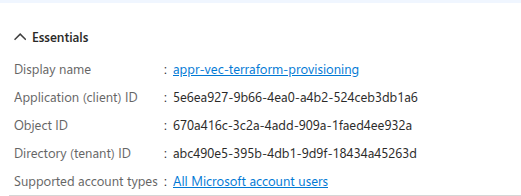

The initial storage account and containing resource group were manually created.

The app registration that runs this pipeline was manually created and given god like access.



**Helpful Commands** 

```bash
terraform init \
    -backend-config="storage_account_name=stveceusterraformstat001" \
    -backend-config="container_name=terraform-ado" \
    -backend-config="key=ado/terraform.tfstate" \
    -backend-config="resource_group_name=rg-vec-eus-administration-001"
```


